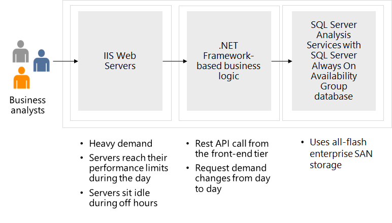

---
casestudy:
  title: コンピューティング ソリューションを設計する
  module: Compute solutions
---

# コンピューティング ソリューションを設計する

## 要件

Tailwind Traders は、自社の製品カタログ アプリケーションをクラウドに移行させたいと考えています。 このアプリケーションは、従来の 3 層構成であり、データ ストアとして SQL Server が使用されています。 IT チームがあなたに期待するのは、アプリケーションの最新化に向けたサポートです。 彼らからは、この図と、改善が可能な領域が示されています。 

* フロントエンド アプリケーションは、.NET Core ベースの Web アプリです。 ピーク時には、1 時間あたり 1,750 人のお客様が Web サイトにアクセスします。 

* アプリケーションは、フロントエンド層の IIS Web サーバー上で実行されます。 この層では、お客様からの製品購入に対するすべての要求が処理されます。 最近のホリデー セールで、フロントエンド サーバーがパフォーマンスの上限に達してしまい、ページの読み込みに長い時間がかかりました。 IT チームは、サーバーの追加を検討しましたが、営業時間外は、サーバーがアイドル状態になることが多くなります。

* 中間層では、お客様の要求を処理するビジネス ロジックがホストされます。 多くの場合、これらは、ヘルプ デスクのサポートの要求です。 サポートの要求はキューに登録されますが、最近になって、待ち時間が非常に長くなっています。 お客様には、メールが届くので、担当者をお待ちいただかなくてもよいようになっています。 とはいえ、不満が募り、待たずに切断してしまうお客様も少なくありません。 お客様の要求は、1 時間あたり 75 から 125 件です。 

* バックエンド層では、SQL Server データベースを使用して、お客様の注文が格納されます。 現在、バックエンド データベース サーバーのパフォーマンスは良好です。

* 高可用性の懸念はありますが、法的要件により、会社はすべてのリソースを 1 つのリージョンに保持する必要があります。

## タスク

* **フロントエンド層。** フロントエンド層には、どの Azure コンピューティング サービスを勧めますか? そのソリューションに決めた理由を説明してください。 

* **中間層。** 中間層には、どの Azure コンピューティング サービスを勧めますか? そのソリューションに決めた理由を説明してください。 

高品質で安定した効率的なクラウド アーキテクチャを生み出すには、ウェル アーキテクト フレームワークの要素をどのように組み込みますか?
