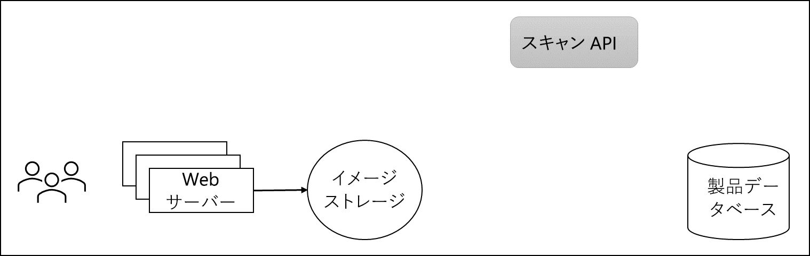

---
casestudy:
  title: アプリのアーキテクチャ ソリューションを設計する
  module: App architecture solutions
---
# アプリのアーキテクチャ ソリューションを設計する

## 要件

Tailwind Traders は、マーケティング部門が提供する既存の写真に加え、お客様から提供された製品の画像を掲載するために、Web サイトを更新することを検討しています。 使用中の製品の写真を増やせば、これまでにお客様が購入後の製品をどのように愛用していたかを、潜在的なお客様に感じていただきやすくなる、というのが彼らの考えです。 これには、次に示すような要件があります。

* アップロードされた画像は、Web サイトへの投稿にあたり、スキャンされたものである必要があります。 法務とマーケティングの両部門は、画像が最初にアップロードされた後、会社の評判の悪化につながる問題や、法的な問題を引き起こしかねない問題がないかどうかについて、画像をチェックすることを要求しています。 必要なスキャンを実行できる社内 API が、既に開発およびデプロイされています。 

* Tailwind Traders は、既存のパターンに基づき、画像のアップロードが 1 日を通して非常に不均等に行われると想定しています。 特定の時間にスキャン ソフトウェアの処理能力を超えるアップロードが発生する一方で、別の時間には、アップロードがほとんど発生しないか、まったく発生しない可能性があります。

* Tailwind Traders は、アップロードされた画像がシステムによってスキャンされ、承認された後、画像の共有に対するお礼のメールをお客様に送信したいと考えています。

* 懸念されるのは、このソリューションのコストと管理です。特に、Tailwind Traders では、最初の段階で、この機能がどのくらい普及するかがわかっていません。 コストを最小限に抑え、可能な場合は、サーバーレス ソリューションを活用します。

 

 

## タスク

会社の Web サイトに追加されるお客様の画像を対象とするアーキテクチャを設計します。 

* 画像はどこに格納する必要がありますか?

* アップロードがスキャンを上回っている場合でも、すべての画像が確実にスキャンされるようにするには、どうすればよいですか?

* 画像が承認され、カタログ データベースが更新された後、お客様への通知はどのように行われますか? 

高品質で安定した効率的なクラウド アーキテクチャを生み出すには、ウェル アーキテクト フレームワークの要素をどのように組み込みますか?

 
