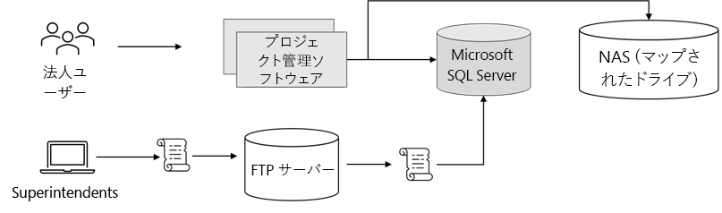
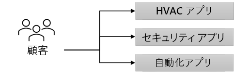

---
casestudy:
  title: Fabrikam Residences
  module: Logging and monitoring solutions
ms.openlocfilehash: 017ba6cc7d6e1d475310d46a7b9a597ade277127
ms.sourcegitcommit: 0398c15157de2f621dd945e76523b824e500901c
ms.translationtype: HT
ms.contentlocale: ja-JP
ms.lasthandoff: 02/23/2022
ms.locfileid: "139134210"
---
ケース スタディ: Fabrikam Residences

予想所要時間: 90 分

## 要件

**このケース スタディでは、次のモジュールとケース スタディを完了している必要があります: コンピューティング、リレーショナル データ、非リレーショナル データ、認証、アプリケーション アーキテクチャ**

あなたは Fabrikam Residences で新たな職位に就き、大きな成功を収めて、急速に成長しています。 Fabrikam Residences は、新築住宅や大掛かりな住宅改築のための建築請負業者であり、高品質の建物を提供し、競合他社よりも新しい統合ホーム テクノロジを提供することで成功を収めています。  

現在、これらのテクノロジは個別の下請会社によって提供および管理されています。 Fabrikam Residences の所有者は、より良い品質、サポート、および顧客のパターンとニーズに関するデータを提供するために、これらのアップグレード済みのテクノロジ オプションを社内で提供し始めたいと考えています。 
 
同社はまず、HVAC (冷暖房) の制御と監視、セキュリティ システムの監視とアラート、およびホーム オートメーションを提供したいと考えています。 これには、新しい Web サイト、データ ストレージ ソリューション、およびデータ インジェスト ソリューションが必要になります。

同社は過去 2 年間で大きな成長を遂げてきました。 今後 12 から 18 か月間で会社が 2 倍の規模になる可能性があると見積もっています。 このような地域市場の急速な成長により、同社は現在のところ、地域市場の外に拡大する計画はありません。

## 現在の状況

Fabrikam 本社は、小規模なデータセンターを 1 か所で運用しています。 このデータセンターでは、会社の **プロジェクト管理 (PM) ソフトウェア** がホストされています。

- PM ソフトウェアでは、サードパーティ製の Windows アプリケーションが使用されています。 このアプリケーションは、単一の Microsoft SQL Server バックエンドを持つ 2 ノードのネットワーク負荷分散 (NLB) クラスターで実行されます。  

- 画像とドキュメントは、専用の NAS アプライアンスに存在するサーバーのマップ済みドライブに格納されます。

- 企業ユーザー (オフィス スタッフ) は、Web フロントエンドを使用して、配送スケジュールや変更オーダーなどのデータを入力します。

-   現場監督者は、Windows ノート PC やタブレットをオフラインで使用して、建築の進捗状況やその他の詳細を継続的に記録します。  これらの変更 (新しい作業指示書など) は、ローカルの変更ファイルに格納されます。  毎日の終わりに、監督者はオフィスに戻ってワイヤレス ネットワークに接続し、小さなスクリプトを実行して変更ファイルを FTP サーバーにアップロードします。  2 つ目のスクリプトは、すべての変更ファイルを処理し、その内容をプロジェクト管理データベース (Microsoft SQL Server) に入力するために、毎晩実行されるようにスケジュールされています。

**ホーム テクノロジ ソフトウェア** は現在、サードパーティによって提供およびホストされており、顧客がアクセスする必要がある 3 つ以上の異なるウェブサイトが含まれています。  このソフトウェアを自社開発の統合ソリューションに置き換えることが提案されています。

## 要件 

**プロジェクト管理ソフトウェア**

- 可能な限り多くのシステムをパブリック クラウド プロバイダーに移行します。

- セキュリティ上の問題が発生したので、既存のスクリプトを置き換えて、FTP よりも安全なシステムを利用します。 また、変更ファイルがアップロードされたらすぐに処理されることが求められています。

- プロジェクト管理データベースの回復性を高めます。 パフォーマンスは問題ではありませんが、会社では、1 つのハードウェア障害が発生した場合にデータベースへのアクセスが失われるのを回避したいと考えています。

**新しいホーム テクノロジ ソリューション**

- 住宅監視センサーから継続的にデータを収集するための新しいソリューションを追加します。
  - 傾向分析とレポートのためにセンサーの一部の読み取り値をデータベース化します。
  - 所有者のニーズに基づいて、構成可能なリアルタイム アラートを提供します。
  
- 住宅所有者の基本設定と設定を保持するようにリレーショナル データベース ソリューションを設計します。
  - システムはスケーラブルである必要があります。
  - 冗長性は重要です。
  
- 新しい統合 Web サイトが社内で開発され、Linux でホストされます。  この Web サイトは、モニターを表示したり、温度やアラートのしきい値などの項目の基本設定を変更したりするために使用されます。 負荷は大きく変化する可能性があり、システムを迅速にスケーリングできる必要があります。

-   別のユーザー アカウントとパスワードを作成せずにシステムにサインインする方法をユーザーに提供します。

- セキュリティ コントロールを実装し、会社が業界標準のベスト プラクティスにどのように合致するかを示す週次レポートを提供します。

## タスク 

1. プロジェクト管理ソフトウェアのソリューションを設計します。 設計の各コンポーネントを選択した理由と、それがソリューション要件をどのように満たすかを説明できるようにしておきます。

2. 新しいホーム テクノロジ ソリューションのアーキテクチャを設計します。 設計の各コンポーネントを選択した理由と、それがソリューション要件をどのように満たすかを説明できるようにしておきます。

高品質で安定した効率的なクラウド アーキテクチャを生み出すには、ウェル アーキテクト フレームワークの要素をどのように組み込みますか?

