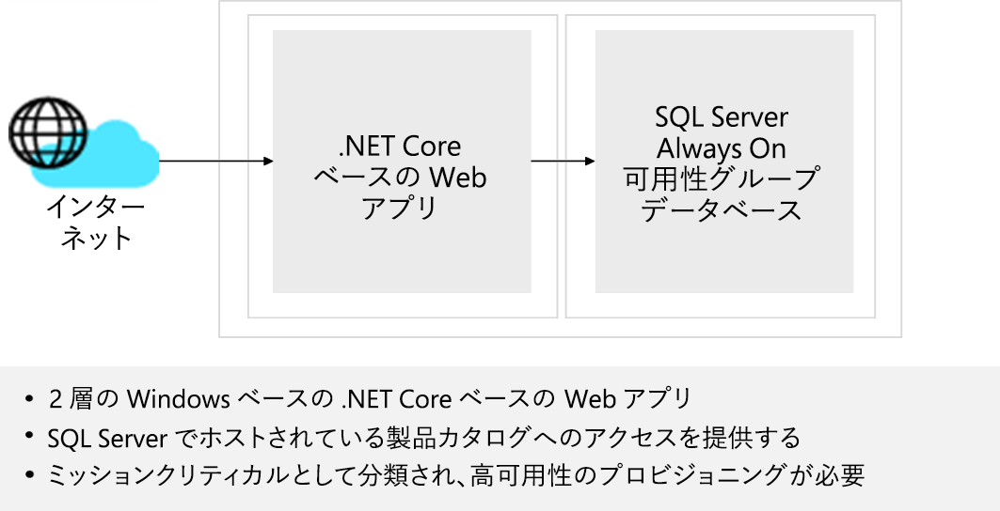

# ネットワーク インフラストラクチャ ソリューションを設計する  

## 要件

Tailwind Traders Enterprise IT チームは、会社のワークロードの一部を Azure に移行する戦略を定義する準備の際に、必要なネットワーク コンポーネントを特定し、それらをサポートするために必要なネットワーク インフラストラクチャを設計する必要があります。 Tailwind Traders は、その運用のグローバル スコープを考慮して、アプリケーションをホストするために複数の Azure リージョンを使います。 これらのアプリケーションのほとんどは、インフラストラクチャとデータ サービスに依存しており、Azure に配置されます。 Azure に移行される内部アプリケーションは、Tailwind Traders のユーザーが引き続きアクセスできる必要があります。 Azure に移行されるインターネット向けのアプリケーションは、外部のお客様が引き続きアクセスできる必要があります。 

最初のネットワーク設計をまとめるために、Tailwind Traders Enterprise IT チームは 2 つの主要なアプリケーションを選択しました。Azure への移行が予想されるワークロードの最も一般的なカテゴリを表しています。  

### 設計 - 製品カタログエンタープライズ アプリケーション

- インターネットに接続されていて、SQL Server Always On 可用性グループ データベースでホストされる、製品カタログへのアクセスを提供する Windows ベースの 2 層 .NET Core ベースの Web アプリ。 このアプリケーションはミッション クリティカルに分類され、可用性 SLA は 99.99%、10 分 RPO、2 時間 RTO です。 

-   ビジネス リーダーが強調しているのは、インターネットに接続しているアプリにアクセスする際の最適なカスタマー エクスペリエンスの重要性です。そのため、Web ページの読み込みと静的コンテンツのダウンロードにかかる時間を最小限に抑えることが重要です。 同様に、Web アプリ コンポーネントとその依存関係をホストする個々のサーバーで障害があっても、それが、顧客によって認識される Web アプリの可用性に与える影響はごくわずかです。 リージョンの障害によって既存の Web セッションが中断される可能性があることがわかりますが、ディザスター リカバリー サイトへのフェールオーバーは自動的に行う必要があります。

- Azure PaaS サービスによって提供される利点を活用するために、Enterprise IT チームは、Azure SQL Database を使用して、製品カタログ エンタープライズ アプリケーションのデータベースを実装することにしました。 

- Tailwind Traders の情報セキュリティ チームとリスク チームは、同じアプリケーションの一部である Azure VM と PaaS サービス間のすべての通信を、PaaS サービスのパブリック エンドポイント経由ではなく、Azure バックボーン経由で移動する必要があります。 

## タスク - 製品カタログエンタープライズ アプリケーション

1. 製品カタログの 2 層ネットワーク ソリューションを設計します。 必要に応じて、設計に Azure Front Door、WAF、Azure Firewall、Azure Load Balancer を含めることができます。 ネットワーク コンポーネントを仮想ネットワークにグループ化し、ネットワーク セキュリティ グループを考慮する必要があります。 設計の各コンポーネントを選択した理由を説明できるよう準備をしてください。 

高品質で安定した効率的なクラウド アーキテクチャを生み出すには、ウェル アーキテクト フレームワークの要素をどのように組み込みますか?

