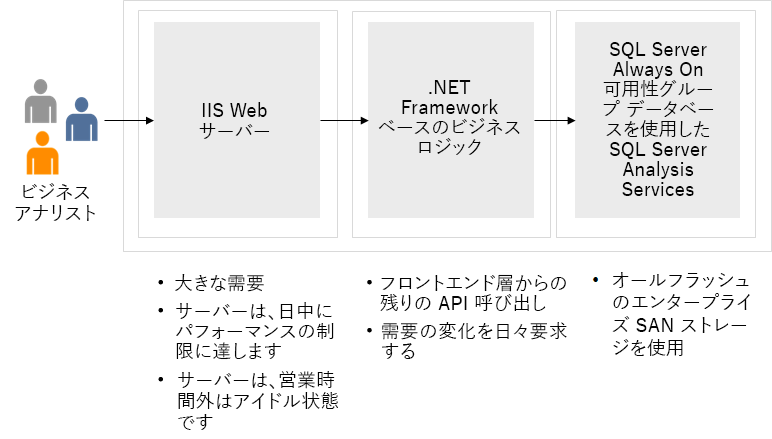

---
casestudy:
  title: ネットワーク ソリューションを設計する - BI エンタープライズ アプリケーション
  module: Network infrastructure solutions
---
# ネットワーク インフラストラクチャ ソリューションを設計する  

## 要件

As the Tailwind Traders Enterprise IT team prepares to define the strategy to migrate some of company’s workloads to Azure, it must identify the required networking components and design a network infrastructure necessary to support them. Considering the global scope of its operations, Tailwind Traders will be using multiple Azure regions to host its applications. Most of these applications have dependencies on infrastructure and data services, which will also reside in Azure. Internal applications migrated to Azure must remain accessible to Tailwind Traders users. Internet-facing applications migrated to Azure must remain accessible to any external customer. 

最初のネットワーク設計をまとめるために、Tailwind Traders Enterprise IT チームは 2 つの主要なアプリケーションを選択しました。Azure への移行が予想されるワークロードの最も一般的なカテゴリを表しています。  

## 設計 - BI エンタープライズ アプリケーション 

-   IIS Web サーバーを実行するフロントエンド層、.NET Framework ベースのビジネス ロジックをホストする中間層、および SQL Server Always On 可用性グループ データベースとして実装されたバックエンド層を備えた内部の Windows ベースの 3 層ビジネス インテリジェンス (BI) エンタープライズ アプリケーション。 

-   このアプリケーションはミッション クリティカルとして分類され、これには可用性 SLA が 99.99% の高可用性プロビジョニングとディザスター リカバリー プロビジョニング (10 分の RPO と 2 時間の RTO) が必要です。

-   To provide connectivity to internal apps migrated to Azure, Tailwind Traders will need to establish hybrid connectivity from their on-premises datacenters. The Enterprise IT group already established that such connectivity will be implemented by using ExpressRoute circuit from its main Seattle datacenter, however, at this point it is not clear yet what would be failover solution in case that circuit becomes unavailable. The Tailwind Traders CFO wants to avoid paying for another, redundant ExpressRoute circuit. 

- There are additional considerations that apply to on-premises connectivity to internal apps migrated to Azure. Since the Tailwind Traders Azure environment will consist of multiple subscriptions and, effectively, multiple virtual networks, to minimize cost, it is important to minimize the number of Azure resources required to implement core networking capabilities. Such capabilities include hybrid connectivity to on-premises locations as well as traffic filtering. Incidentally, this need to minimize cost aligns with the Information Security and Risk requirements, which state that all traffic between on-premises locations and Azure virtual networks must flow via a single virtual network, which will be hosting components responsible for hybrid connectivity and traffic filtering. 

-   As per requirements defined by the Tailwind Traders Information Security and Risk teams, all communication between Azure VMs in different tiers that are part of the same application must allow only the ports required to run and maintain the application. However, due to IP address space limitations, it might not be possible to allocate dedicated subnets to each tier. Enterprise IT group needs to identify the optimal way to configure source and destination for traffic filtering that would not require directly referencing IP addresses or IP address ranges.

## タスク - BI エンタープライズ アプリケーション 

1. Tailwind Traders Enterprise IT チームは、会社のワークロードの一部を Azure に移行する戦略を定義する準備の際に、必要なネットワーク コンポーネントを特定し、それらをサポートするために必要なネットワーク インフラストラクチャを設計する必要があります。 

2. Tailwind Traders は、その運用のグローバル スコープを考慮して、アプリケーションをホストするために複数の Azure リージョンを使います。 

3. ストレージ (リレーショナル) のケース スタディに基づいて、ストレージ アカウントへのアクセスを保護し、選択したユーザーのみがストレージ アカウントに確実にアクセスできるようにするには、ネットワーク設計をどのように更新しますか?

4. SQL バックエンドの最新化に基づいて、データベースへの実用的なアクセスを有効にして、フロント エンドのコードベース内にハードコードされたシークレットが含まれないようにするにはどうすればよいですか?

高品質で安定した効率的なクラウド アーキテクチャを生み出すには、ウェル アーキテクト フレームワークの要素をどのように組み込みますか?
