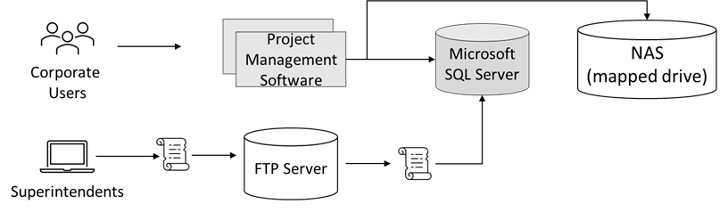

---
casestudy:
    title: 'オプションのケース?スタディ: Fabrikam Residences'
    module: 'オプションのケース?スタディ: Fabrikam Residences'
---
# オプションのケース?スタディ: Fabrikam Residences

推定時間: 90 分

## 要件

**このケース スタディでは、次のモジュールとケース スタディを完了している必要があります。  コンピューティング、リレーショナル データ、非リレーショナル データ、認証、アプリケーション アーキテクチャ**

Fabrikam Residences にあなたは入社しましたが、同社は非常に成功しており、急速な成長を遂げています。Fabrikam Residencesは、新しい住宅や主要な住宅の改装の建築請負業者であり、高品質の建物を提供し、競合他社よりも新しい統合されたホーム テクノロジーを提供することによって成功を収めています。  

現在、これらの技術は、別々の下請け会社によって提供され、管理されています。Fabrikam Residences のオーナーは、顧客のパターンやニーズに関するより良い品質、サポート、データを提供するために、これらのアップグレードされたテクノロジー オプションを社内で提供し始めたいと考えています。 
 
まず、同社は HVAC (冷暖房) の制御と監視、セキュリティシステムの監視とアラート、およびホーム オートメーションを提供したいと考えています。これには、新しいウェブサイト、データ ストレージ ソリューション、データ インジェスチョン ソリューションが必要です。

同社は過去2年間で大きな成長を遂げました。同社は、今後12?18ヶ月間に 2 倍の規模になるかもしれないと見積もっています。このような地域市場の急速な成長に伴い、同社は現在、地域市場外に拡大する計画はありません。

## 現在の状況

Fabrikam 本社は、小規模なデータセンターを 1 ケ所で運用しています。データセンターは、同社の **プロジェクト管理 (PM) ソフトウェア**をホストします。

- PM ソフトウェアは、サードパーティ製の Windows  アプリケーションを使用します。アプリケーションは、1 つの Microsoft SQL Server バックエンドを持つ 2 ノード のネットワーク負荷分散 (NLB) クラスターで実行されます。  

- 画像と文書は、専用の NAS アプライアンス上に存在するサーバーのマップされたドライブに格納されます。

- 企業ユーザー、オフィススタッフは、ウェブ フロントエンドを使用して、供給納入スケジュールや変更命令などのデータを入力します。

- 現場監督は、 Windows のノートパソコンとタブレットをオフラインで使用して、継続的に建物の進捗状況やその他の詳細を記録します。  新しい作業指示書などのこれらの変更は、ローカルの変更ファイルに格納されます 。  毎日の終わりに、監督はオフィスに戻ってワイヤレス ネットワークに接続し、小さなスクリプトを実行して FTP サーバーに変更ファイルをアップロードします。   2 番目のスクリプトは、すべての変更ファイルを処理し、その内容をプロジェクト管理データベース (Microsoft SQL Server) に入力するために、毎晩実行するようにスケジュールされています。

**ホームテクノロジーソフトウェア** は、現在、第三者によって提供され、ホストされており、顧客が訪問しなければならない少なくとも 3 つの異なるウェブサイトが含まれます。  ソフトウェアは、社内で開発され、統一されたソリューションに置き換えられるように提案されています。

## 要件 

**プロジェクト管理ソフトウェア**

- できるだけ多くのシステムをパブリック クラウド プロバイダーに移行します。

- 既存のスクリプトを置き換え、セキュリティ上の懸念が生じたため、 FTP よりも安全なシステムを活用します。また、変更ファイルがアップロードされると、できるだけ早く処理されるように確認を求められます。

- プロジェクト管理データベースの復元力を向上します。パフォーマンスは問題ではありませんが、ハードウェア障害が 1 回発生した場合にデータベースにアクセスできなくなることを避けたいと同社は考えています。

**新しいホーム テクノロジー ソリューション**

- ホーム監視センサーから継続的にデータを収集する新しいソリューションを追加します。
  - 傾向分析とレポート作成のためのセンサーの読み取り値をデータベース化します。
  - オーナーのニーズに基づいて、設定可能なリアルタイムアラートを提供します。
  
- 住宅所有者の設定と設定を保持するリレーショナル データベース ソリューションを設計します。
  - システムはスケーラブルでなければなりません。
  - 冗長性は重要です。
  
- 新しく統合されたウェブサイトは社内で開発され、 Linux でホストされます。  このウェブサイトは、モニターの表示や、温度や警告のしきい値などの項目の設定を変更するために使用されます。負荷は大きく異なる可能性があり、システムは迅速に拡張できる必要があります。

-	別のユーザー アカウントとパスワードを作成せずに、システムにサインインする方法をユーザーに提供します。

- セキュリティ コントロールを実装し、業界標準のベスト プラクティスに対する会社の一致を概説する週次レポートを提供します。

## タスク 

1. プロジェクト管理ソフトウェアのソリューションを設計します。設計の各コンポーネントを選択した理由と、それがソリューション要件を満たす方法を説明する準備をしてください。

2. 新しいホーム テクノロジー ソリューションのアーキテクチャを設計します。設計の各コンポーネントを選択した理由と、それがソリューション要件を満たす方法を説明する準備をしてください。

十分に設計されたフレームワークの柱をどのように組み込んで、高品質で安定した効率的なクラウドアーキテクチャを生み出していますか?
